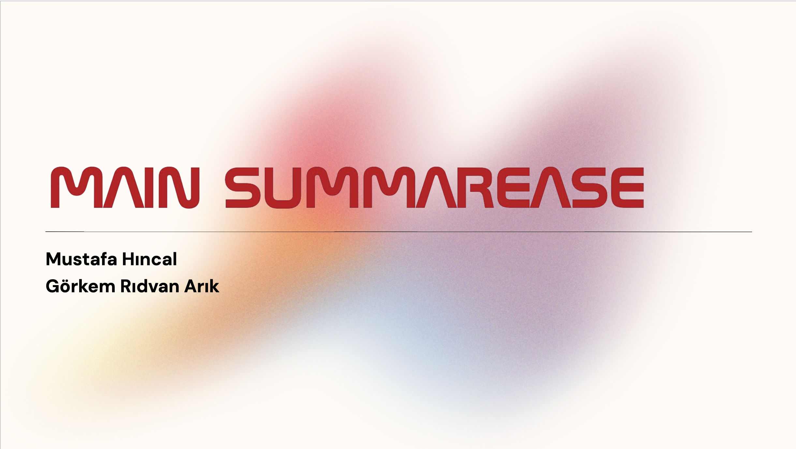
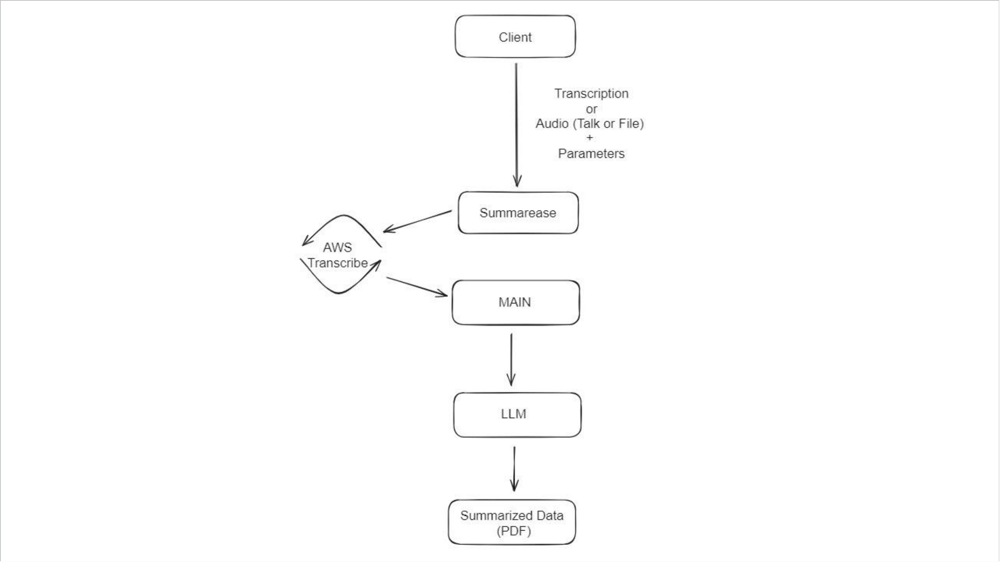
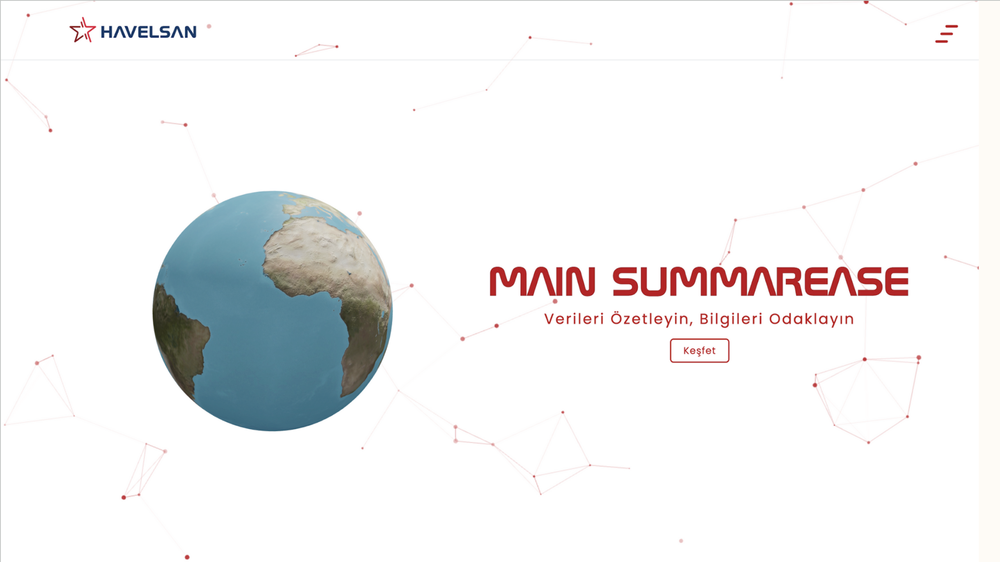
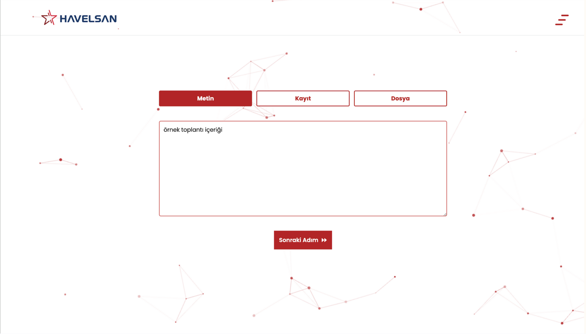
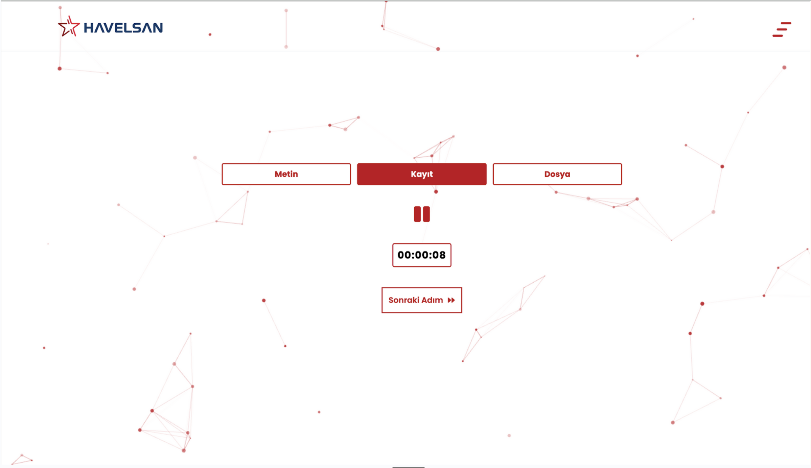
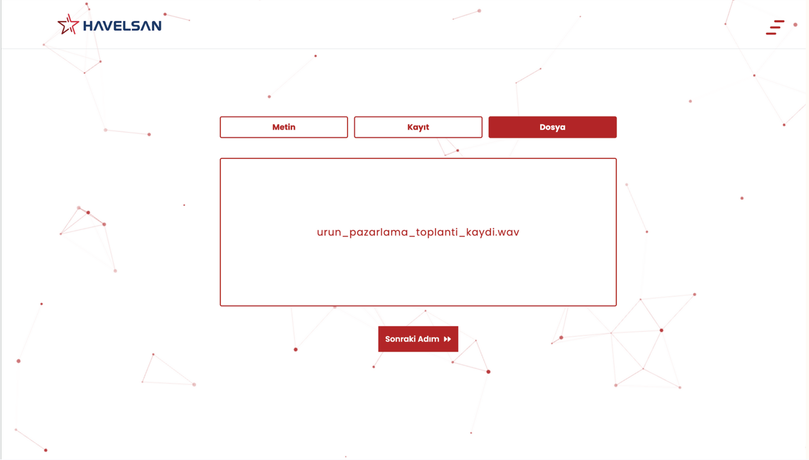
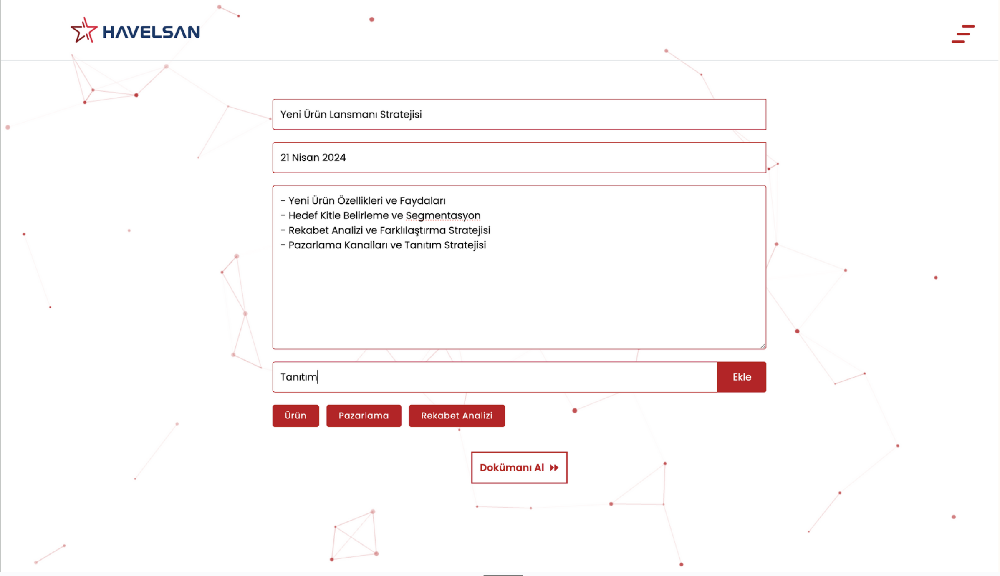
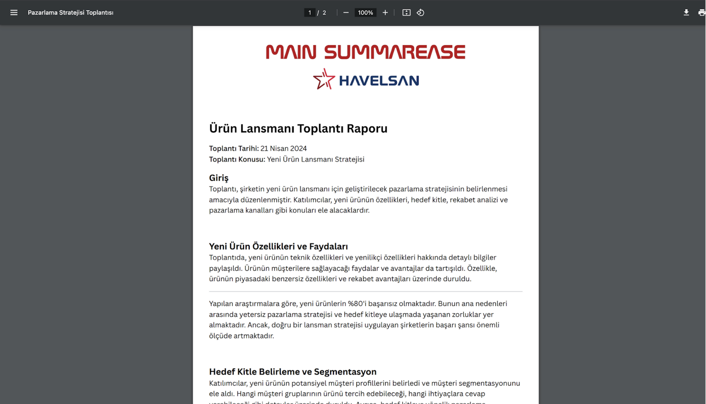

# Summarease - Havelsan Ekspress Project

## Description

Summarease is an application designed to manage the dense flow of information in the business world by converting conversations, meetings, and job interviews into text format and summarizing them to focus on desired information. With its user-friendly interface and MAIN feature, it quickly comprehends complex texts and extracts important details. Additionally, it can provide statistical information on relevant topics by using tags associated with specific keywords.

## Innovation

Unlike other summarization tools, it directs summarization according to user preferences and enhances summaries with statistical explanations through its tagging feature. These features personalize the summarization process for users while enabling deeper analysis and understanding of texts.

## Feasibility

With Havelsan's resources and capabilities, necessary infrastructure and resources can be provided, and SummarEase can be technically made feasible.

## Impact

The potential benefits of SummarEase have the capability to significantly enhance companies' and clients' information management processes. It is expected to be a versatile solution for improving information management processes across various industries.

## Scalability

SummarEase can serve a broad user base and address diverse needs across different sectors.

## Integration

Summarease can integrate with the MAIN Platform and existing infrastructure. Designed to be compatible with the MAIN Platform, SummarEase enhances existing functionalities while also providing new capabilities.

## PROJECT PRESENTATION

[Summarease Project Presentation](https://docs.google.com/presentation/d/15Spfm5hPp6W7lGO9k6KvrkHzZb-tnn8S/edit#slide=id.p1)

 

 

 

 

 

 

 

### Expected Output

 
